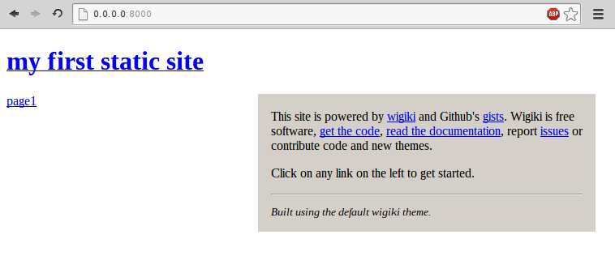

### Wiki + Gists = Wigiki

The concept behind wigiki was to create a tool which can group and organize all my random notes that I write from time to time as [Gists](https://gist.github.com/).

The workflow is simple, you supply a json configuration file and a folder where some template files reside and wigiki will generate a static html site. The site can be deployed on your own server or on Github (using the static pages feature). Each gist present in the configuration file, will be a page on the site.

The templates are using the amazing [jinja2](http://jinja.pocoo.org/docs/) template engine, which means that it is fairly easy to create your own themes. Also, the project includes a very basic theme inside the `templates` folder.

### Installation

The requirements for wigiki are:

* Python>=__2.7__
* Jinja2

To install wigiki run:

```
$ pip install wigiki
```

To install from source code, download or clone wigiki from [github][home] and run:

```
$ python setup.py install
```

In order to contribute clone [the repo][home] and install using:

```
$ pip install -e .
```

Distributions packaging wigiki:

* [Archlinux (AUR)][arch]

### Configuration

Currently only the `json` format is supported for configuration. `YAML` support is also planned. The configuration file will usually reside in your site's root directory. It includes options about the gists (pages) but it also supports options that you can also supply from the command line. 

The configuration file supports three main configuration sections shown below.

section key | description
--- | ---
site | Global options that are available to the templates
gists | Gists to use as pages
app | Application parameters that can also be supplied from the command line

#### site

Everything under the `site` key will be available in the templates as a python dictionary. The default template uses a variable `title` to set the site's template:

```
<h1>{{ site['title'] }}</h1>
```

#### gists

Under the `gists` key you configure the gists that you want to include to your site. Each gist is essentially a page on your site. You define gists using the author's `username`, the `title` of the page and the `gist id`. Wigiki combines these values and builds the appropriate urls to include the gists.

For example the following configuration:

```
"tlatsas" : {
    "test": 5764229
}
```

will include the gist [https://gist.github.com/tlatsas/5764229](https://gist.github.com/tlatsas/5764229) under the name `test`.

#### app

Under the `app` key you configure parameters that can also be supplied from the command line. That way you don't have to give the same arguments over and over again. Currently the following parameters are supported:

parameter | description
--- | ---
output | Generate site in given folder [default: _site]
baseurl | The base URL for all site pages [default: /]
templates | Template path

This is a sample configuration file:

```json
{
    "site": {
        "title": "a static wiki-like site using gists"
    },
    "gists": {
        "tlatsas": {
            "page 1 title": "5764226",
            "page 2 title": "5764229"
        }
    },
    "app": {
        "output": "_site",
        "baseurl": "notes",
        "templates": "templates/default"
    }
}
```

### Generate your first site

Wigiki comes with a default minimal theme. If you install wigiki system wide or
using a package from your distribution the theme resides in
`/usr/share/wigiki/themes/default`.

Navigate in a folder and create a configuration file with the name `config.json`.
Use the sample file found in the repo or in the configuration section above. Example:

```json
{
    "site": {
        "title": "my first static site"
    },
    "gists": {
        "tlatsas": {
            "page1": "5764229"
        }
    },
    "app": {
        "output": "_site",
        "baseurl": "/",
        "templates": "/usr/share/wigiki/templates/default"
    }
}
```

Then run `wigiki`. This will build a site in the folder **_site** with the following contents:

```
_site
|-- assets
|   `-- style.css
|-- index.html
`-- page1
    `-- index.html
```

The assets folder is copied directly from the theme. To preview the site you can run:

```
$ python -m http.server
```

for python>=3, or if you use the 2.x version of python run:

```
$ python -m SimpleHTTPServer
```

inside the **_site** folder.




As you can see, the default theme is pretty minimal and lightweight. You can view
my deploy which has more pages/gists [here][deploy].
Using the command line arguments you can override any option in the `app`
section of the configuration file wihout editing it.

### Other themes

TODO

### Deploy

TODO

### Writing theme templates

TODO

### Support and Contributing

Check out the documentation at [http://tlatsas.github.io/wigiki][docs], report an
issue at [https://github.com/tlatsas/wigiki/issues][issues] or contribute at
[https://github.com/tlatsas/wigiki][home].


[home]: https://github.com/tlatsas/wigiki
[docs]: http://tlatsas.github.io/wigiki
[issues]: https://github.com/tlatsas/wigiki/issues
[arch]: https://aur.archlinux.org/packages/wigiki-git/
[deploy]: https://dl.kodama.gr/notes/
